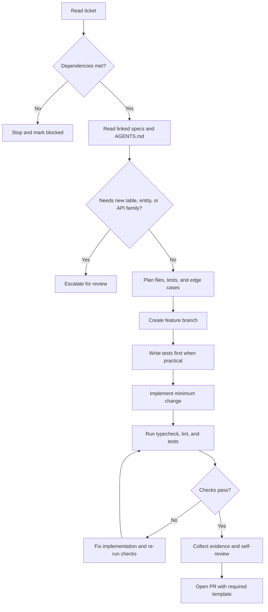

# Ticket to Code - Fridgr

## Quick Start

1. Read the ticket fully before touching code.
2. Confirm dependencies and linked specs first.
3. Re-read `AGENTS.md` and `CONVENTIONS.md`.
4. Plan the smallest change that satisfies the acceptance criteria.
5. Prove the work with tests, checks, and evidence in the PR.

## Workflow

1. Read the ticket.
   Focus on Title, Problem, In Scope, Out of Scope, Dependencies, Implementation Notes, Acceptance Criteria, Evidence Required, and Escalation Triggers.
2. Check dependencies.
   Do not start if prerequisite tickets are still blocked or unresolved.
3. Find linked specs.
   Follow architecture, contract, API, or security references before designing implementation details.
4. Understand the scope boundary.
   Treat Out of Scope as a hard stop, not a suggestion.
5. Read `AGENTS.md`.
   Refresh repo constraints, security rules, and escalation triggers.
6. Plan before coding.
   List the files to create or edit, the expected behavior, and the edge cases to verify.
7. Create a feature branch.
   Use `feature/<ticket-id>-<short-description>` as documented in `CONTRIBUTING.md`.
8. Write tests first when practical.
   Base tests on the acceptance criteria and verify the missing behavior is real.
9. Implement.
   Write the minimum change needed to satisfy the ticket without expanding adjacent systems.
10. Run quality gates.
    Run `npm run typecheck`, `npm run lint`, and `npm test`.
11. Self-review.
    Check for `any`, secrets, scope creep, broken edge cases, and doc drift.
12. Fill evidence.
    Capture the proof the ticket asked for: checks run, screenshots, notes, links, or validation output.
13. Create the PR.
    Use the repo PR template and the title format `[Wave X] <ticket-title>`.
14. Escalate if stuck.
    Stop and ask for review if the task needs a new entity/API/table, hits security ambiguity, conflicts with docs, or cannot be verified safely.

## Ticket Field Mapping

| Ticket field         | How it maps to implementation                             |
| -------------------- | --------------------------------------------------------- |
| Problem              | Explains why the change exists and what should improve    |
| In Scope             | Defines the allowed files, modules, or behaviors to touch |
| Out of Scope         | Defines what must remain untouched                        |
| Dependencies         | Determines whether coding can start now                   |
| Implementation Notes | Supplies technical constraints or preferred patterns      |
| Acceptance Criteria  | Converts directly into tests and verification steps       |
| Evidence Required    | Defines what the PR must show as proof                    |
| Escalation Triggers  | Defines when to stop and ask for help                     |

## Common Pitfalls

- Expanding scope with "while I'm here" changes
- Inventing new tables, entities, or APIs not required by the ticket
- Ignoring Out of Scope because the adjacent fix seems easy
- Skipping tests and using "it compiles" as proof
- Using `any` to bypass type issues instead of fixing them
- Editing files owned by another active ticket without coordination
- Hardcoding secrets, keys, or environment-specific values
- Updating implementation without updating repo docs when rules changed

## Decision Flow

## Working Rule

If the ticket cannot be explained clearly, tested clearly, and reviewed in one sitting, it is probably too big or not ready for implementation.
