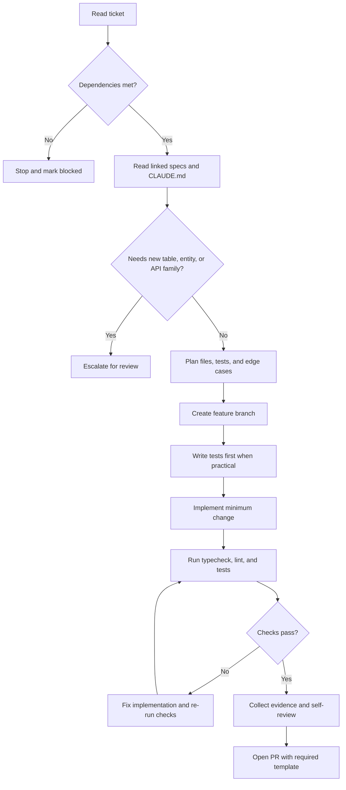

# Ticket To Code Guide

Use this guide when turning a Notion ticket into implementation work.
For repo rules, see [../CLAUDE.md](../CLAUDE.md). For naming rules, see
[../CONVENTIONS.md](../CONVENTIONS.md). For commit message rules, see
[COMMIT_FORMAT.md](COMMIT_FORMAT.md).

## Decision flow

## Step 1: Read the ticket

- Open the ticket page in Notion from the task board or prompt link.
- Read the Summary, In Scope, Out of Scope, and Implementation Notes.
- Identify dependencies, acceptance criteria, evidence required, and
  escalation triggers.

## Step 2: Find the spec

- Check the ticket References section for linked spec docs.
- Common sources include Implementation Contracts, API Contracts,
  Event and State Machine Contracts, and the Matching Engine spec.
- If the ticket references a specific section, read only that section.
- If no spec exists for the work, stop and escalate.

## Step 3: Check the contracts

- Find the relevant contract in the referenced specs.
- Verify that types, endpoints, database tables, and events match.
- If the ticket and spec conflict, stop and escalate.
- Do not invent new contracts. Implement what is specified.

## Step 4: Plan before coding

- List the files you expect to create or modify.
- Identify which domain or domains are touched.
- If the change crosses domain boundaries, verify the spec allows it.
- Write tests first when the task adds or changes logic.

## Step 5: Implement

- Create a feature branch named `feature/<ticket-id>-<short-description>`.
- Follow the rules in [../CLAUDE.md](../CLAUDE.md).
- Follow the naming rules in [../CONVENTIONS.md](../CONVENTIONS.md).
- Follow the commit rules in [COMMIT_FORMAT.md](COMMIT_FORMAT.md).
- Stay within the ticket's In Scope section.

## Step 6: Verify

- Run `npm run typecheck` and confirm zero errors.
- Run `npm run lint` and confirm zero warnings.
- Run `npm test` and confirm all relevant tests pass.
- Walk through each acceptance criterion one by one.
- Fill the Evidence Required section with concrete proof.

## Step 7: Submit

- Open a pull request targeting `develop`.
- Use the PR title format `[domain] Short description`.
- Fill out the PR template in
  [../.github/PULL_REQUEST_TEMPLATE.md](../.github/PULL_REQUEST_TEMPLATE.md).
- Link the Notion ticket in the PR description.
- Request review.

## Step 8: Escalation checklist

Before submitting, confirm none of these apply:

- Two docs conflict.
- A new table, entity, or API family is needed.
- Security or privacy impact is unclear.
- A destructive migration is proposed.
- The task touches auth, deletion, or permissions.
- Acceptance criteria cannot be tested.

If any item applies, stop, report findings, and wait for a human decision.

## Ticket field mapping

| Ticket field         | How it maps to implementation                             |
| -------------------- | --------------------------------------------------------- |
| Problem              | Explains why the change exists and what should improve    |
| In Scope             | Defines the allowed files, modules, or behaviors to touch |
| Out of Scope         | Defines what must remain untouched                        |
| Dependencies         | Determines whether coding can start now                   |
| Implementation Notes | Supplies technical constraints or preferred patterns      |
| Acceptance Criteria  | Converts directly into tests and verification steps       |
| Evidence Required    | Defines what the PR must show as proof                    |
| Escalation Triggers  | Defines when to stop and ask for help                     |

## Common pitfalls

- Expanding scope with "while I'm here" changes
- Inventing new tables, entities, or APIs not required by the ticket
- Ignoring Out of Scope because the adjacent fix seems easy
- Skipping tests and using "it compiles" as proof
- Using `any` to bypass type issues instead of fixing them
- Editing files owned by another active ticket without coordination
- Hardcoding secrets, keys, or environment-specific values
- Updating implementation without updating repo docs when rules changed

## Working rule

If the ticket cannot be explained clearly, tested clearly, and reviewed in
one sitting, it is probably too big or not ready for implementation.
